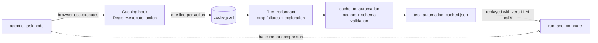

# What I Implemented

A memory layer for `agentic_task` nodes: run the agent once, record what it actually did, discard
the exploration, and emit a deterministic Optexity automation that replays the same work with no
LLM in the loop.

Measured on `roboform.com/filling-test-all-fields`: **27.7s → 16.2s, 2 agent LLM calls → 0.**

---

## Pipeline



Five modules, each independently runnable:

| Module | Repo | Role |
|---|---|---|
| `browser_use/memory_cache/choke.py` | browser-use | Records every dispatched action with the real locator it resolved to |
| `optexity/tools/filter.py` | optexity | Drops failed and non-replayable steps; last-write-wins per element |
| `optexity/tools/cache_to_automation.py` | optexity | Cache → validated `Automation` |
| `optexity/tools/inspect_cache.py` | optexity | Shows what was captured and flags unusable caches before conversion |
| `optexity/tools/run_and_compare.py` | optexity | Latency and LLM-usage comparison between two runs |

Bonus: `optexity/tools/llm_cache_to_automation.py` — the same conversion done by an LLM, diffed
against the deterministic converter.

---

## 1. The caching hook

`Registry.execute_action` is the single point every action passes through between "the LLM chose
this" and "Playwright did it". Wrapping that one method gets the action name, the parameters, the
resolved element and the outcome — all already structured — without touching individual action
functions or parsing model output.

What it records is **not** the `[n]` DOM index the LLM saw. That index is an artifact of one DOM
snapshot; a popup or a lazy-loaded image renumbers it. Replaying by index would swap LLM
non-determinism for DOM-ordering non-determinism. Instead `_classify_selector` resolves the element
to durable locator information, in Optexity's documented preference order:

```
role (only with a distinguishing accessible name) → aria-label → data-testid
    → visible text → #id → tag[name='…'] → [placeholder='…'] → xpath
```

The role guard matters more than it looks. Roles exist on essentially every interactive element, so
an unguarded role branch makes every other strategy unreachable and emits
`get_by_role("textbox", name="")` — which matches every input on the page, trips Playwright strict
mode, and silently drops the replay back onto the LLM.

Output is one JSON line per action in `cache.jsonl`, truncated at the first write of each process so
a run's cache is exactly one run.

## 2. Filtering

Two rules, both explainable in a sentence:

- **Drop failures.** Only the attempt that worked describes the workflow.
- **Last write wins**, keyed on `(strategy, selector, accessible_name)` — not the selector alone.
  With the role strategy the selector is the ARIA role, so four form fields all key as `"textbox"`
  and a selector-only key silently collapses an entire form into one node.

Plus a drop-list for actions with no deterministic equivalent (`done`, `wait`, `scroll`,
`screenshot`, `extract`, `evaluate`, file operations) — the agent's thinking, not the workflow.

## 3. Conversion

Maps browser-use's registered action names onto Optexity interaction actions:

| browser-use | Optexity |
|---|---|
| `click` | `click_element` |
| `input` | `input_text` |
| `navigate` | `go_to_url` |
| `select_dropdown` | `select_option` |
| `go_back` | `go_back` |

`send_keys` and `upload_file` are deliberately unmapped: a cached step carries neither a
`KEY_NAMES`-valid key nor a file source, so converting them would produce a node that fails at
replay. They raise a clear error instead.

Every locator gets `.first` appended, and each node inherits `url`, `parameters` and
`expected_downloads` from the seed automation, so the cached automation is triggered exactly like the
agentic one. Output is passed through `Automation.model_validate` before it reaches disk.

## 4. Measurement

`run_and_compare` reads what a run already leaves behind — `started_at`/`completed_at` and
`token_usage` from each step's `state.json`. It also counts the agent's `conversation_*.txt` files,
which is the only way to see browser-use's LLM usage from outside: that usage lives on the
`AgentHistoryList` returned by `agent.run()` and is never merged into `memory.token_usage`.

It names the outcome explicitly, because two of the three look like success if you only read elapsed
time — falling back to the agent, and falling back to Optexity's index-prediction LLM.

## 5. Bonus — LLM-assisted conversion

`llm_cache_to_automation.py` gives a model the cache plus `Automation.model_json_schema()` and asks
for the automation directly. Schema validation failures are fed back verbatim for up to three
repair attempts rather than retrying blind.

`build_and_diff` runs both converters on the same cache and compares node counts and commands. The
deterministic converter stays the source of truth: both outputs are schema-valid by construction, so
without a baseline there is no way to notice a dropped node or an invented selector.

**Verified live** against `gemini/gemini-3.5-flash-lite` on the roboform cache: 4 nodes vs 4 nodes,
and all four commands byte-identical to the deterministic converter.

---

## What changed from my first attempt

The first version was written against the documentation before anything had been run. Running it
disproved several assumptions, and those corrections are the most interesting part of this work:

| Assumed | Actually |
|---|---|
| `_ACTION_MAP` keys `click_element_by_index`, `input_text`, `go_to_url` | Those names do not exist in this fork. They are `click`, `input`, `navigate` — every step would have raised. |
| The node's `xpath` field is an alternative to `command` | Nothing under `optexity/inference` ever reads it. A node with only an xpath has **no locator** and goes straight to the LLM. Now emitted as `locator("xpath=…")`. |
| Deduplicating on the resolved selector is sufficient | It is the ARIA role, shared by every field on a form. |
| `prompt_instructions` is required by the schema | It defaults to `""`. It matters, but for recovery, not validation. |
| An agentic run produces clicks and typing | It also reaches for `evaluate` and does the work in JavaScript, leaving no locator behind. Now excluded from the agent's toolset. |
| Nodes can replay back to back | The agentic run re-read the DOM before every action, absorbing page loads implicitly. Deterministic replay races them, so steps that change the URL get a longer settle time. |

Two pieces from the first attempt were removed rather than kept: a scaffolded stub `Automation`
model, which made schema validation meaningless, and a self-healing runner whose core function was
`raise NotImplementedError`.
